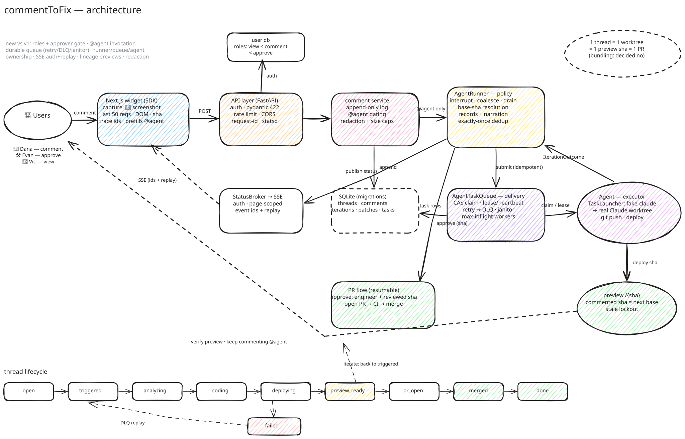

# commentToFix

Comment on a live (pre-prod) site like a Google Doc — an agent captures the runtime
context, ships a fix to a preview deployment, and you iterate in the same thread
until the PR merges.

**Live demo:** https://commenttofix.onrender.com — nothing to install; it's a
shared demo instance, so you may see threads left by other visitors.

## Try it (2 minutes)

1. Hit **💬 Comment**, click the yellow **Edit Profile** button, write
   *"@agent this button style is not right"* → watch the thread run
   `triggered → analyzing → putting up code change → deploying → preview ready`.
2. Open the preview (new sha, patched page) and follow up: *"@agent make it
   green and font size 16"* → the next iteration branches off the preview sha.
3. Comment again **while it's analyzing** → it interrupts and combines; comment
   while it's coding/deploying → it queues for the next iteration.
4. Switch to **Evan (Engineer)** — only approvers see **Approve → open PR**
   (designers see "waiting for @evan"); then `pr_open → merged → done`.
5. Break it on purpose: put `flaky` (worker crashes once, retry succeeds),
   `fatal` (crashes every attempt → dead-letter queue), or `vanish` (worker
   dies silently; the janitor reclaims the lease) in a comment, then inspect
   `GET /api/queue`.
6. Click the 📦 chip on any comment to see the raw capture bundle the agent
   gets: screenshot, network trace, console buffer, DOM snapshot, sha, viewport.

A few rules worth knowing: only comments mentioning **@agent** trigger agent
work — plain comments are just collaboration. The sha you *comment on* is the
iteration base, so commenting on an older preview branches off that version
(a rollback, announced in the thread). The final PR diff is always
`original base sha...final preview sha`, with every intermediate sha kept as
history. Closed threads reject follow-ups and their previews go read-only.

## Architecture



```
backend/                  pure API server (FastAPI)
  main.py                 app wiring + lifespan (starts the agent worker pool)
  domain/models.py        core entities: ThreadStatus, Thread, Comment,
                          Iteration, Patch, User
  container.py            the whole object graph wired in one factory
  routes/                 API layer: comments, threads, previews, SSE events,
                          queue observability, health, auth deps
  comments/               domain logic: append-only rules, input validation,
                          per-user rate limiting
  agent/
    agent.py              Agent: pure EXECUTOR — run the launcher, push branch,
                          deploy preview, PR side effects
    launchers/            TaskLauncher abstraction + registry; fake_claude.py
                          simulates a Claude Code worktree task. Add real
                          runners here; pick via AGENT_LAUNCHER.
    integrations.py       GitClient / PreviewDeployer / PRService seams + fakes
    queue.py              DELIVERY — atomic CAS claims, leases + heartbeats,
                          retry → DLQ, janitor
    runner.py             DECIDES + NARRATES — interrupt/coalesce/queue policy,
                          base-sha resolution, system comments, status pubsub,
                          exactly-once dedup, restart recovery
  db/                     SQLite + migrations; typed repos (the only SQL code)
  demo/                   DEMO-ONLY fake app APIs (network traffic for capture)

frontend/                 Next.js app (App Router, TypeScript)
  app/                    landing, demo/profile (the fake "Acme Social" site),
                          preview/[sha] (patches applied server-side)
  components/widget/      the commentToFix overlay: Widget, Composer,
                          ThreadPanel, Markers
  lib/                    api client, capture engine, validation (mirrors
                          backend limits), wire types
  hooks/                  useThreads (fetch + SSE live updates)
```

Engineering notes:

- **Validation is layered**: pydantic schemas own the transport shape (422 at
  the edge); `backend/comments/utils.py` owns the policy (limits, truncation)
  with `frontend/lib/validation.ts` mirroring it for instant feedback.
- **Config is centralized**: the backend reads env only in
  [backend/config.py](backend/config.py) (`.env` at the repo root, see
  `.env.example`); the frontend uses Next's `.env.local`.
- **Observability** (`backend/observability/`): request-id-correlated
  structured logs (`LOG_FORMAT=json` for shippers), statsd metrics (per-route
  QPS/latency, queue depth/outcomes, `@track` for agent internals),
  `/healthz` + `/readyz`, traceable 500s.
- Threads, previews, and the task queue survive restarts (SQLite + recovery
  on startup).

## What's simulated vs what's real

Real, working end-to-end:

- Capture bundle: screenshot, last 50 network requests with trace ids,
  console buffer, DOM snapshot, sha, viewport, session
- Append-only comment threads, roles/permissions, approval gating
- SSE live updates (pubsub) and the interrupt / coalesce / queue policy
- Preview lineage + comment-sha-based iteration bases (rollback included)
- Durable task queue: atomic claims, leases + heartbeats, retries,
  dead-letter queue + replay, janitor reclaiming dead workers
- SQLite persistence with migrations; restart recovery
- Input validation and per-user rate limiting

Simulated (each behind a real interface, swappable in `container.py`):

- The agent's reasoning — `fake_claude.py` maps comment intent to a CSS patch
  with realistic pacing, instead of a real Claude Code worktree task
- Git push / preview deploy / PR — fakes behind GitClient, PreviewDeployer,
  PRService
- Auth — a user header instead of real sessions

## Capture safety

The capture bundle is runtime surveillance of a real page — screenshots, DOM,
network URLs, and console output can carry secrets and PII.

Defenses in this POC:

- Client-side redaction first (the capture SDK scrubs before upload)
- Server-side redaction again: secret-looking query params, `key: value`
  assignments, JWTs, password-input values
- Per-field caps plus a total bundle ceiling
- See the note in `backend/comments/utils.py`

What production would add: request/response bodies off by default, allowlist
DOM capture, retention TTLs + deletion, encryption at rest, capture access
scoped to thread participants.

## Deploy

[render.yaml](render.yaml) is a Render Blueprint: dashboard → New →
Blueprint → connect this repo → Apply. It creates both services (backend with
a 1GB persistent disk for SQLite, frontend with `BACKEND_URL` baked at build
time) on always-on Starter instances.

## Run locally

Two processes: the FastAPI backend and the Next.js frontend.

```bash
# backend (API on :4173)
python3 -m venv .venv && .venv/bin/pip install -r requirements.txt
.venv/bin/uvicorn backend.main:app --port 4173

# frontend (app on :3000, proxies /api/* to the backend)
cd frontend && npm install && npm run dev
```

Open http://localhost:3000. Or with Docker:
`docker compose up --build` (frontend on :3000, backend on :4173).

Tests: `.venv/bin/pytest backend/tests` (validation, comment service, queue
semantics, full agent flows, API layer — ~2s on shrunk timers) and
`cd frontend && npm test` (validation + capture selector paths).
